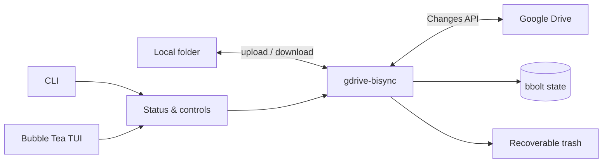
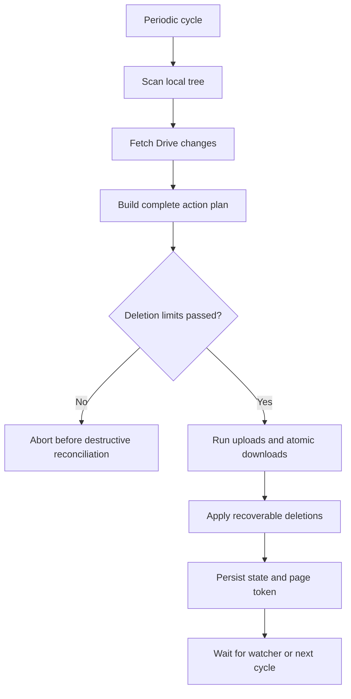
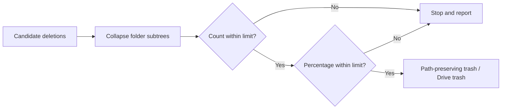

# gdrive-bisync

A safety-focused bidirectional synchronizer between a local directory and Google Drive.



## Highlights

| Area | Capability |
|---|---|
| Sync | Real-time local watcher and incremental Google Drive polling |
| Safety | Deletion preflight, count/percentage limits, and dry-run previews |
| Recovery | Path-preserving local trash with indexed restore |
| Reliability | Atomic downloads, rotating database backups, and single-instance locking |
| Management | Status, pause/resume, CLI trash management, and Bubble Tea TUI |
| Diagnostics | Structured categories with stable hash-generated terminal colors |
| Platforms | Linux and Windows |

## Quick start

| Step | Action | Command or location |
|---:|---|---|
| 1 | Enable Google Drive API and create an OAuth Desktop client | [Google Cloud Console](https://console.cloud.google.com/) |
| 2 | Save the downloaded OAuth file as `credentials.json` | Linux: `~/.config/gdrive-bisync/config/credentials.json` |
| 3 | Create `config.json` beside it | See the example below |
| 4 | Authorize the application | `gdrive-bisync --setup` |
| 5 | Preview the first sync | `gdrive-bisync --dry-run` |
| 6 | Start syncing | `gdrive-bisync` |

Windows uses `%USERPROFILE%\.config\gdrive-bisync\config\` for configuration.

Minimal `config.json`:

```json
{
  "LOCAL_SYNC_PATH": "~/GoogleDrive",
  "REMOTE_FOLDER_ID": "root"
}
```

To sync a specific Drive folder, copy its ID from a URL such as:

```text
https://drive.google.com/drive/folders/YOUR_FOLDER_ID
```

## Installation

| Method | Commands |
|---|---|
| Arch Linux (paru) | `paru -S gdrive-bisync` |
| Arch Linux (yay) | `yay -S gdrive-bisync` |
| Source | `git clone https://github.com/AzPepoze/gdrive-bisync`<br>`cd gdrive-bisync`<br>`make` |

Building from source requires Go 1.25 or newer.

## CLI reference

Running `gdrive-bisync` in an interactive terminal opens the Bubble Tea manager automatically. The same command remains a background sync daemon when launched without a terminal, including through systemd.

### Sync and authentication

| Option | Short | Purpose | Changes data? |
|---|---:|---|---:|
| `gdrive-bisync` | — | Run the foreground sync engine | Yes |
| `--setup` | `-s` | Complete Google OAuth authentication | Auth files only |
| `--dry-run` | — | Scan and print the planned actions without changing local or remote files | No sync changes |
| `--force` | `-f` | Back up and reset local sync state, then perform a fresh scan | State only |
| `--allow-unsafe-deletes` | — | Bypass configured deletion limits for this explicit run | Potentially |
| `--show-logs` | `-l` | Show informational console logs | No |

Use the unsafe-deletion override only after reviewing a dry run:

```bash
gdrive-bisync --dry-run
gdrive-bisync --allow-unsafe-deletes
```

### Status and control

| Option | Purpose | Notes |
|---|---|---|
| `--status` | Show process state, PID, pause state, task count, last sync, and last error | Does not start another sync engine |
| `--pause` | Pause periodic reconciliation and watcher uploads | Local changes remain on disk and are found after resume |
| `--resume` | Resume syncing | The next watcher event or periodic cycle continues work |
| `--tui` | Open the Bubble Tea terminal manager | Uses the same status, pause, resume, and restore layer |

### Trash and recovery

| Option | Purpose | Example |
|---|---|---|
| `--trash-list` | List indexed recoverable deletions | `gdrive-bisync --trash-list` |
| `--trash-restore ID` | Restore an entry to its original relative path | `gdrive-bisync --trash-restore 20260814T004242.395108454` |

Restore refuses to overwrite an existing live path. Move or rename the live file first if you intentionally want the trashed version.

### Service management

| Option | Platform | Purpose |
|---|---|---|
| `--install-service` | Linux | Install the systemd user-service definition |
| `--uninstall-service` | Linux | Stop, disable, and remove the user service |

Useful systemd commands:

| Action | Command |
|---|---|
| Enable and start | `systemctl --user enable --now gdrive-bisync` |
| Show status | `systemctl --user status gdrive-bisync` |
| Restart | `systemctl --user restart gdrive-bisync` |
| Stop | `systemctl --user stop gdrive-bisync` |
| Follow logs | `journalctl --user -u gdrive-bisync -f` |

## Bubble Tea TUI

Open it without starting a second sync process:

```bash
gdrive-bisync --tui
```

| Key | Action |
|:---:|---|
| `p` | Pause syncing |
| `r` | Resume syncing |
| `x` | Enter a trash ID and restore it |
| `Esc` | Cancel restore input |
| `q` or `Ctrl+C` | Quit the TUI |

The dashboard refreshes once per second and displays:

```text
gdrive-bisync manager

State: idle         PID: 12345    Paused: false
Last sync: 2026-08-14 01:20:00    Planned tasks: 0

Recoverable trash: 2
  20260814T004242.395108454  Secured/example.conf
  20260813T183010.112233445  Notes/archive.md

p pause · r resume · x restore · q quit
```

## Configuration reference

Place `config.json` in `~/.config/gdrive-bisync/config/` on Linux or `%USERPROFILE%\.config\gdrive-bisync\config\` on Windows.

### Paths and timing

| Option | Type | Default | Description |
|---|---|---:|---|
| `LOCAL_SYNC_PATH` | string | `~/GoogleDrive` | Local synchronization root |
| `REMOTE_FOLDER_ID` | string | `root` | Google Drive folder ID; `root` means My Drive |
| `DB_FILE_NAME` | string | `.gdrive-bisync.db` | Local bbolt state filename |
| `WATCH_DEBOUNCE_DELAY` | integer | `5000` | Delay in milliseconds before processing watcher activity |
| `PERIODIC_SYNC_INTERVAL_MS` | integer | `60000` | Delay in milliseconds between remote-change checks |

### Concurrency and retries

| Option | Type | Default | Description |
|---|---|---:|---|
| `MAX_CONCURRENT_SCANS` | integer | `20` | Concurrent Drive scan requests |
| `MAX_CONCURRENT_DOWNLOADS` | integer | `20` | Simultaneous downloads |
| `MAX_CONCURRENT_UPLOADS` | integer | `10` | Simultaneous uploads |
| `MAX_RETRIES` | integer | `10` | Maximum retry attempts for supported operations |

### Safety and retention

| Option | Type | Default | Description |
|---|---|---:|---|
| `MAX_DELETIONS_PER_SYNC` | integer | `20` | Abort if a plan exceeds this deletion count; `0` disables the count limit |
| `MAX_DELETION_PERCENT` | number | `5` | Abort if deletions exceed this percentage of the local scan; `0` disables it |
| `DATABASE_BACKUP_COUNT` | integer | `5` | Number of rotating database backups retained locally |
| `ignore` | string[] | `node_modules` pattern | Additional regular expressions for ignored paths |
| `SHOW_LOGS` | boolean | `false` | Enable informational console and daily file logs |
| `DESKTOP_NOTIFICATIONS` | boolean | `true` | Send critical Linux desktop notifications when `notify-send` is available |
| `NOTIFICATION_COOLDOWN_MS` | integer | `1800000` | Suppress repeated notifications for the same failure for 30 minutes; `0` disables cooldown |

Internal state, trash, backups, and partial downloads are always ignored automatically.

Full example:

```json
{
  "LOCAL_SYNC_PATH": "~/GoogleDrive",
  "REMOTE_FOLDER_ID": "root",
  "DB_FILE_NAME": ".gdrive-bisync.db",
  "WATCH_DEBOUNCE_DELAY": 5000,
  "PERIODIC_SYNC_INTERVAL_MS": 60000,
  "MAX_CONCURRENT_SCANS": 20,
  "MAX_CONCURRENT_DOWNLOADS": 20,
  "MAX_CONCURRENT_UPLOADS": 10,
  "MAX_RETRIES": 10,
  "MAX_DELETIONS_PER_SYNC": 20,
  "MAX_DELETION_PERCENT": 5,
  "DATABASE_BACKUP_COUNT": 5,
  "SHOW_LOGS": false,
  "DESKTOP_NOTIFICATIONS": true,
  "NOTIFICATION_COOLDOWN_MS": 1800000,
  "ignore": ["(^|.*[\\\\/])node_modules([\\\\/].*|$)"]
}
```

## How synchronization works



### Decision summary

| Local state | Remote state | Previous evidence | Typical action |
|---|---|---|---|
| New or changed | Missing or unchanged | Local is authoritative | Upload |
| Missing or unchanged | New or changed | Remote is authoritative | Download |
| Changed | Deleted | Local changed since last sync | Re-upload to protect local work |
| Unchanged | Deleted | Prior remote checksum exists | Move local item to recoverable trash |
| Deleted | Unchanged | Prior sync metadata exists | Trash remote item |
| Both changed | Both present | Conflict | Preserve the current local-wins policy |

Downloads are written to a temporary sibling, flushed, and atomically renamed. Watcher events produced by active downloads are suppressed to prevent upload/download loops.

## Safety model



| Protection | Behavior |
|---|---|
| Single-instance lock | Prevents a service and manual process from owning the sync state simultaneously |
| Dry run | Clones in-memory state and blocks local, remote, and database mutations |
| Deletion thresholds | Validate destructive work before reconciliation |
| Folder collapsing | Stores a deleted folder as one restorable subtree instead of fragmented children |
| Atomic download | Leaves the existing destination intact when transfer fails |
| DB rotation | Copies the previous database before opening a sync session |
| Restore validation | Rejects path traversal and refuses destination overwrite |

## Files and runtime state

### Inside the sync root

| Path | Purpose | Synced to Drive? |
|---|---|:---:|
| `.gdrive-bisync.db` | Remote index, metadata, and Drive page token | No |
| `.gdrive-bisync-backups/` | Rotating state backups | No |
| `.trash/<date>/<entry-id>/manifest.json` | Recovery metadata | No |
| `.trash/<date>/<entry-id>/files/<original-path>` | Recoverable payload | No |
| `.gdrive-download-*.partial` | Temporary atomic-download payload | No |

### Inside the user configuration directory

| Path | Purpose | Permissions |
|---|---|---:|
| `config/credentials.json` | Google OAuth client configuration | User-managed |
| `config/token.json` | Google OAuth token | User-managed |
| `runtime/instance.lock` | Single-process ownership and PID | `0600` |
| `runtime/status.json` | TUI/CLI runtime status | `0600` |
| `runtime/paused` | Pause marker | `0600` |

## Logging

Every log record contains a category inferred from its calling package:

```text
2026-08-14 01:20:00 [INFO ] [CORE      ] Starting sync cycle...
2026-08-14 01:20:01 [INFO ] [API       ] Uploading file path=Notes/plan.md
2026-08-14 01:20:02 [WARN ] [STORE     ] Database backup delayed error=...
```

Category colors are generated from a stable FNV hash and cached dynamically. Adding a package automatically creates a consistent color—there is no category/color registry to maintain. Scan animation is shown only in an interactive terminal, preventing ANSI progress output from becoming systemd journal “blob data.”

### Desktop notifications

On Linux, critical authentication, database, watcher, and sync failures are sent through `notify-send`. Repeated failures in the same category are deduplicated for the configured cooldown, and a successful sync produces one recovery notification after a sync failure. If `notify-send` or a graphical notification session is unavailable, synchronization continues and the error remains available in logs, `--status`, and the TUI.

## Development

| Task | Command |
|---|---|
| Run tests | `go test ./...` |
| Run race detector | `go test -race ./...` |
| Run static checks | `go vet ./...` |
| Build Linux binary | `make linux` |
| Build release archives | `make release` |
